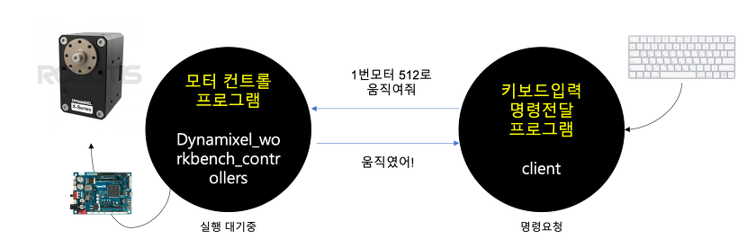
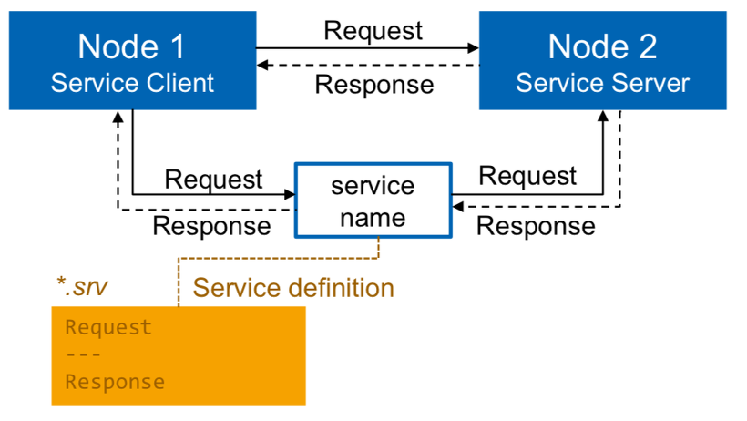
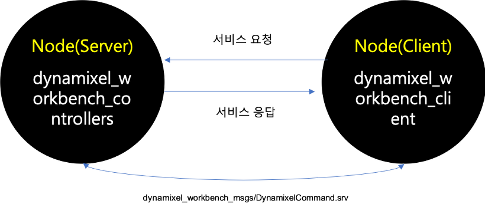

# Dynamixel Command 서비스 클라이언트 만들기

앞서 01 글에서는 Dynamixel Workbench의 Controller를 이용하여 모터의 위치제어를 하였습니다.
오늘은 내가만든 프로그램에서 모터에 명령을 내리는법을 익혀보겠습니다. 




Controller Server와 클라이언트
--
dynamixel_controllers.launch 를 실행하게되면 내 PC에서는 다이나믹셀에 전원을 인가시키고 명령을 받을 준비가 됩니다. 
즉 Controller 라는 서비스서버가 동작중인 상태가 되는 것이죠. ROS통신 중 서비스(service)가 있습니다. 특정 목적의 작업에 해당되는 서비스를 요청(request)하는 서비스, 클라이언트와 서비스 응답(response)을 담당하는 서비스 서버간의 양방향 메시지 통신입니다.우리는 서비스 서버(Controller)에 요청과 응답을 받는 클라이언트를 만들어 보겠습니다.


rosservice 예제 익히기
--
ROS Tutorials에서 제공하는 서비스 메시지 통신 예제입니다.
- [C++ 통신예제](http://wiki.ros.org/ROS/Tutorials/WritingServiceClient%28c%2B%2B%29)

서비스는 로봇에 특정 동작을 수행하도록 요청할 때 사용됩니다. 장점으로는 일회성 통신 방식이라 네트워크에 부하가 적습니다.


> 출처 : https://medium.com/@raymonduchen/ros-%E6%87%B6%E4%BA%BA%E7%AD%86%E8%A8%98-4-%E4%BB%A5c-%E6%92%B0%E5%AF%ABservice%E8%88%87client-1f5fa3184c60


rosservice client 응용하기 
--
앞서 '서비스' 를 이용하여 노드간 통신하는 법을 익혔습니다. 이제는 모터를 제어하는 'Controller' 노드에게 '명령을 내리는' 노드를 만들어 보겠습니다. 그리고 그 둘 간 '서비스' 메세지를 이용하여 명령을 전달하겠습니다. ROS 튜토리얼의 서비스클라이언트를 응용하여 모터제어 명령을 내리는 서비스클라이언트를 만들었습니다.

- 01 노드와 패키지를 다운로드 합니다.
```
$git clone https://github.com/davincioh/dynamixel-workbench-client.git
```

- 02 DyanmixelCommand.cpp 파일을 열어봅니다. ROS튜토리얼에서 제공하는 Service Client 예제에서 크게 두 곳을 수정하였습니다.


```
#include "ros/ros.h"
#include "dynamixel_workbench_msgs/DynamixelCommand.h"
#include <cstdlib>

int main(int argc, char **argv)
{
  ros::init(argc, argv, "controllers_dynamixel_command");
  if (argc != 3)
  {
    ROS_INFO("usage : controllers_dynamixel_command ID PositionValue");
    return 1;
  }

  ros::NodeHandle n;
  ros::ServiceClient client = n.serviceClient<dynamixel_workbench_msgs::DynamixelCommand>
("/dynamixel_workbench/dynamixel_command");

  dynamixel_workbench_msgs::DynamixelCommand srv;

  /* dynamixel_workbench_msgs/DynamixelCommand.srv
  string command
  uint8 id
  string addr_name
  int32 value
  ---
  bool comm_result
*/

  std::string item_command = "";
  std::string item_addr = "Goal_Position";

  srv.request.command = item_command;
  srv.request.id = atoll(argv[1]);
  srv.request.addr_name = item_addr;
  srv.request.value = atoll(argv[2]);

  if (client.call(srv))
  {
    ROS_INFO("send ID and Position Value : %ld, %ld", (uint8_t)srv.request.id, (int32_t)srv.request.value);
    ROS_INFO("receive result : %ld", (bool)srv.response.comm_result);
  }
  else
  {
    ROS_ERROR("Failed to call dynamixel_command");
    return 1;
  }
  return 0;
}
```


ros::ServiceClient
--
```
ros::ServiceClient client = n.serviceClient<dynamixel_workbench_msgs::DynamixelCommand>("/dynamixel_workbench/dynamixel_command");
```

- client라는 서비스클라이언트를 선언합니다.[ServiceClient Class Reference](http://docs.ros.org/jade/api/roscpp/html/classros_1_1ServiceClient.html)

- client는 Dynamixel_workbench의 msgs중 DynamixelCommand 파일을 참조합니다.  [Dynamixel Workbench DynamixelCommand SVR](http://emanual.robotis.com/docs/en/popup/dynamixel_workbench_msgs_DynamixelCommand/)


dynamixel_workbench_msgs::DynamixelCommand srv;
--
```
ROS_INFO("send ID and Position Value : %ld, %ld", (uint8_t)srv.request.id, (int32_t)srv.request.value);
```
키보드로 두 값을 입력받아 'Dynamixel Command'에 Msg를 보냅니다. 앞서 확인해본 SVR파일의 Item과 Value값을 확인하게 되면 다음과 같습니다.

- Service Definition

```
  string command

  uint8 id
  string addr_name
  int32 value
  ---
  bool comm_result
```


각 Item에 id와 각도 값을 넣어주면 workbench의 controllers가 동작하게 됩니다. 이제 Controller 노드와, Client 노드를 각각 실행하게되면 키보드 입력에따라 모터가 움직이게 됩니다.



